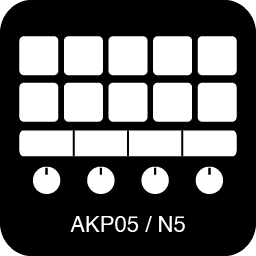

# OpenDeck Ajazz AKP03 / Mirabox N3 Plugin

An unofficial plugin for Mirabox N3-family devices

## OpenDeck version

Requires OpenDeck 2.5.0 or newer

## Supported devices

- Ajazz AKP03 (0300:1001)
- Ajazz AKP03E (0300:3002)
- Ajazz AKP03R (0300:1003)
- Mirabox N3 (N3EN?) (6603:1003)

## Installation

1. Download an archive from [releases](https://github.com/4ndv/opendeck-akp03/releases)
2. In OpenDeck: Plugins -> Install from file
3. Download [udev rules](./40-opendeck-akp03.rules) and install them by copying into `/etc/udev/rules.d/` and running `sudo udevadm control --reload-rules`
4. Unplug and plug again the device, restart OpenDeck

## Acknowledgments

This plugin is heavily based on work by contributors of [elgato-streamdeck](https://github.com/streamduck-org/elgato-streamdeck) crate
